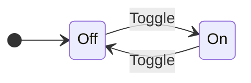
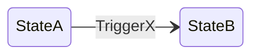
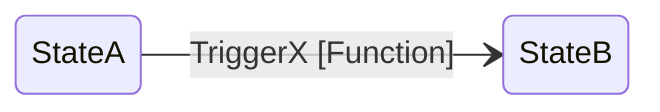
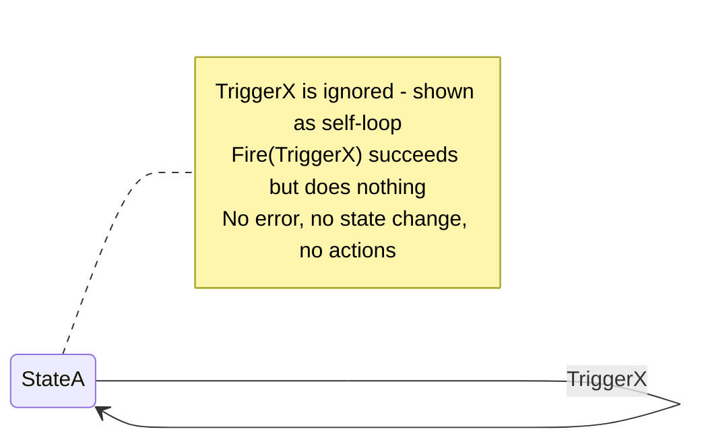
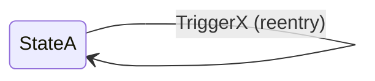
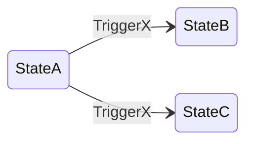
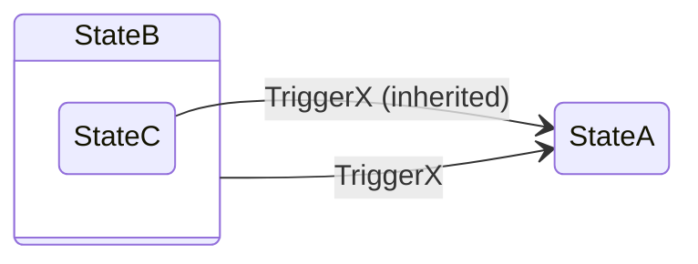
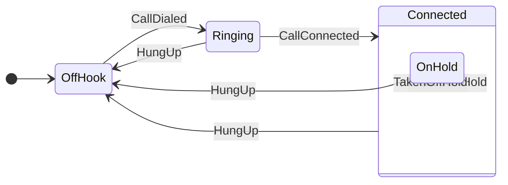

# Stateless - A State Machine Library for Go

[](https://pkg.go.dev/github.com/atlekbai/stateless)

A feature-complete, generic state machine library for Go, inspired by the [.NET Stateless library](https://github.com/dotnet-state-machine/stateless).

## Features

- **Generic Types**: Use any comparable type for states and triggers
- **Fluent Configuration API**: Easy-to-read state machine configuration
- **Guard Conditions**: Conditional transitions with guard functions
- **Entry/Exit Actions**: Execute actions when entering or exiting states with full transition info
- **Activation/Deactivation**: Lifecycle hooks for state machine activation
- **Hierarchical States**: Support for substates and superstates
- **Parameterized Triggers**: Pass data with trigger firing using type assertions
- **Dynamic Transitions**: Determine destination state at runtime
- **Reentry Transitions**: Support for self-transitions with action execution
- **Internal Transitions**: Actions without state change
- **Firing Modes**: Immediate or queued trigger processing
- **Introspection**: Reflect on state machine configuration
- **Graph Generation**: Export to DOT (Graphviz) and Mermaid formats
- **Thread-Safe**: Safe for concurrent access with queued firing mode
- **Context Support**: All actions receive context.Context and can return errors

## Installation

```bash
go get github.com/atlekbai/stateless
```

## Quick Start

```go
package main

import (
    "context"
    "fmt"
    "github.com/atlekbai/stateless"
)

type State int
type Trigger int

const (
    Off State = iota
    On
)

const (
    Toggle Trigger = iota
)

func main() {
    // Create a new state machine
    sm := stateless.NewStateMachine[State, Trigger](Off)

    // Configure states
    sm.Configure(Off).
        Permit(Toggle, On).
        OnExit(func(ctx context.Context, t stateless.Transition[State, Trigger]) error {
            fmt.Println("Light turning on...")
            return nil
        })

    sm.Configure(On).
        Permit(Toggle, Off).
        OnEntry(func(ctx context.Context, t stateless.Transition[State, Trigger]) error {
            fmt.Println("Light is on!")
            return nil
        })

    // Fire triggers
    sm.Fire(Toggle, nil) // Off -> On
    sm.Fire(Toggle, nil) // On -> Off
}
```

### Visualizing the State Machine

> [!TIP]
> You can generate Mermaid or DOT (Graphviz) diagrams to visualize your state machine. This is helpful for documentation and debugging complex state flows.



## Configuration

### Basic Transitions

```go
sm.Configure(StateA).
    Permit(TriggerX, StateB)  // TriggerX causes transition to StateB
```




### Conditional Transitions (Guards)

Guards return `nil` if the transition should proceed, or use `stateless.Reject()` for expected rejections:

```go
sm.Configure(StateA).
    PermitIf(TriggerX, StateB, func(_ context.Context, _ any) error {
        if !someCondition {
            return stateless.Reject("condition not met")
        }
        return nil
    })
```

> [!IMPORTANT]
> Use `stateless.Reject()` for expected guard rejections (business logic). Any other error returned from a guard is treated as an unexpected error and will propagate immediately.

```go
// Expected rejection - guard intentionally blocks transition
return stateless.Reject("insufficient balance")

// Unexpected error - something went wrong during check
return fmt.Errorf("database error: %w", err)
```



### Ignored Triggers

```go
sm.Configure(StateA).
    Ignore(TriggerX)  // TriggerX does nothing in StateA
```



> [!TIP]
> Use `Ignore()` when a trigger is valid but should have no effect in certain states. This prevents errors while keeping the trigger valid.

### Reentry Transitions

```go
sm.Configure(StateA).
    PermitReentry(TriggerX)  // TriggerX causes exit and entry of StateA
```



> [!NOTE]
> Reentry transitions exit and re-enter the same state, firing both exit and entry actions. This differs from internal transitions which don't fire these actions.

### Internal Transitions

```go
sm.Configure(StateA).
    InternalTransition(TriggerX, func(ctx context.Context, t stateless.Transition[State, Trigger]) error {
        // Action executed without state change
        // Access t.Args for any passed arguments
        return nil
    })
```

### Dynamic Transitions

```go
sm.Configure(StateA).
    PermitDynamic(TriggerX, func(ctx context.Context, args any) (State, error) {
        if someCondition {
            return StateB, nil
        }
        return StateC, nil
    })

// If you don't need ctx or args, just ignore them:
sm.Configure(StateA).
    PermitDynamic(TriggerX, func(_ context.Context, _ any) (State, error) {
        return StateB, nil
    })
```



> [!NOTE]
> Dynamic transitions let you determine the destination state at runtime based on trigger arguments or application state. Perfect for complex routing logic. The diagram shows possible destinations; the StateSelector function chooses one when the trigger fires.

## Entry and Exit Actions

All entry and exit actions receive full transition information including source, destination, trigger, and arguments:

```go
sm.Configure(StateA).
    OnEntry(func(ctx context.Context, t stateless.Transition[State, Trigger]) error {
        fmt.Printf("Entering StateA from %v via trigger %v\n", t.Source, t.Trigger)
        return nil
    }).
    OnExit(func(ctx context.Context, t stateless.Transition[State, Trigger]) error {
        fmt.Printf("Exiting StateA to %v\n", t.Destination)
        return nil
    })

// To handle specific triggers, check the trigger in the action:
sm.Configure(StateB).
    OnEntry(func(ctx context.Context, t stateless.Transition[State, Trigger]) error {
        if t.Trigger == TriggerX {
            fmt.Println("Entered via TriggerX - special handling")
        }
        return nil
    })
```


> [!NOTE]
> Entry and exit actions fire in a predictable order during transitions: first the source state's OnExit, then the destination state's OnEntry. Both actions receive the complete Transition object with source, destination, trigger, and arguments.

## Hierarchical States

```go
// StateC is a substate of StateB
sm.Configure(StateB).
    Permit(TriggerX, StateA)

sm.Configure(StateC).
    SubstateOf(StateB)  // StateC inherits TriggerX -> StateA

// Check if in superstate
sm.IsInState(StateB)  // true when in StateB or StateC
```



> [!NOTE]
> Substates inherit transitions from their parent states. This allows you to define common transitions once in the parent and have them automatically available in all child states.

## Parameterized Triggers

Use type assertions to access typed arguments:

```go
// Define a struct for trigger arguments
type CallArgs struct {
    CallerID string
}

// Access typed arguments in entry action
sm.Configure(StateB).
    OnEntry(func(ctx context.Context, t stateless.Transition[State, Trigger]) error {
        if args, ok := t.Args.(CallArgs); ok {
            fmt.Printf("Call from: %s\n", args.CallerID)
        }
        return nil
    })

// Fire with struct argument
sm.Fire(TriggerX, CallArgs{CallerID: "555-1234"})
```

> [!TIP]
> Define a dedicated struct type for each trigger's arguments. This makes the code more maintainable and provides clear documentation of what data each trigger expects.

## Activation and Deactivation

Activation/deactivation actions only receive context (they are not triggered by Fire):

```go
sm.Configure(StateA).
    OnActivate(func(ctx context.Context) error {
        fmt.Println("State machine activated in StateA")
        return nil
    }).
    OnDeactivate(func(ctx context.Context) error {
        fmt.Println("State machine deactivated in StateA")
        return nil
    })

sm.Activate(context.Background())    // Calls OnActivate
sm.Deactivate(context.Background())  // Calls OnDeactivate
```

## Event Handlers

```go
// Called when a transition occurs
sm.OnTransitioned(func(t stateless.Transition[State, Trigger]) {
    fmt.Printf("%v -> %v\n", t.Source, t.Destination)
})

// Called after all transition actions complete
sm.OnTransitionCompleted(func(t stateless.Transition[State, Trigger]) {
    fmt.Println("Transition completed")
})

// Handle unhandled triggers
sm.OnUnhandledTrigger(func(state State, trigger Trigger, guards []error) {
    fmt.Printf("Unhandled trigger %v in state %v\n", trigger, state)
})
```

## Firing Modes

```go
// Immediate mode (default) - triggers processed synchronously
sm := stateless.NewStateMachine[State, Trigger](StateA)

// Queued mode - triggers queued and processed one at a time
sm := stateless.NewStateMachineWithMode[State, Trigger](StateA, stateless.FiringQueued)
```

> [!WARNING]
> Use **queued mode** for concurrent access. Immediate mode is not thread-safe when multiple goroutines fire triggers simultaneously.

## External State Storage

```go
var currentState State = StateA

sm := stateless.NewStateMachineWithExternalStorage[State, Trigger](
    func() State { return currentState },     // Accessor
    func(s State) { currentState = s },       // Mutator
)
```

## Introspection

```go
// Check current state
state := sm.State()

// Check if trigger can be fired
canFire := sm.CanFire(TriggerX, nil)

// Get permitted triggers
triggers := sm.GetPermittedTriggers(nil)

// Check if in a state (including substates)
isInState := sm.IsInState(StateA)

// Get full state machine info
info := sm.GetInfo()
```

## Graph Generation

### DOT Graph (Graphviz)

```go
import "github.com/atlekbai/stateless/graph"

info := sm.GetInfo()
dot := graph.UmlDotGraph(info)
fmt.Println(dot)
```

### Mermaid Graph

```go
import "github.com/atlekbai/stateless/graph"

info := sm.GetInfo()
direction := graph.LeftToRight
mermaid := graph.MermaidGraph(info, &direction)
fmt.Println(mermaid)
```

## Context Support

All actions receive a `context.Context` parameter. Use `FireCtx` to pass a custom context:

```go
import "context"

ctx, cancel := context.WithTimeout(context.Background(), 5*time.Second)
defer cancel()

err := sm.FireCtx(ctx, TriggerX, nil)
```

> [!NOTE]
> Context cancellation is checked before firing each trigger. Actions can also check `ctx.Err()` to handle cancellation gracefully. `Fire()` uses `context.Background()` by default.

## Complete Example

```go
package main

import (
    "context"
    "fmt"
    "github.com/atlekbai/stateless"
    "github.com/atlekbai/stateless/graph"
)

type PhoneState int
type PhoneTrigger int

const (
    OffHook PhoneState = iota
    Ringing
    Connected
    OnHold
)

const (
    CallDialed PhoneTrigger = iota
    CallConnected
    PlacedOnHold
    TakenOffHold
    HungUp
)

func main() {
    sm := stateless.NewStateMachine[PhoneState, PhoneTrigger](OffHook)

    sm.Configure(OffHook).
        Permit(CallDialed, Ringing)

    sm.Configure(Ringing).
        Permit(HungUp, OffHook).
        Permit(CallConnected, Connected)

    sm.Configure(Connected).
        OnEntry(func(ctx context.Context, t stateless.Transition[PhoneState, PhoneTrigger]) error {
            fmt.Println("Call connected!")
            return nil
        }).
        Permit(HungUp, OffHook).
        Permit(PlacedOnHold, OnHold)

    sm.Configure(OnHold).
        SubstateOf(Connected).
        Permit(TakenOffHold, Connected).
        Permit(HungUp, OffHook)

    sm.OnTransitioned(func(t stateless.Transition[PhoneState, PhoneTrigger]) {
        fmt.Printf("Transitioned: %v -> %v\n", t.Source, t.Destination)
    })

    // Generate graph
    info := sm.GetInfo()
    fmt.Println(graph.UmlDotGraph(info))

    // Use the state machine
    sm.Fire(CallDialed, nil)
    sm.Fire(CallConnected, nil)
    sm.Fire(PlacedOnHold, nil)
    sm.Fire(TakenOffHold, nil)
    sm.Fire(HungUp, nil)
}
```



> [!TIP]
> This example demonstrates several key features: hierarchical states (OnHold as a substate of Connected), entry actions, transition events, and graph generation. The state machine models a realistic phone call lifecycle with proper state transitions and event handling.

## License

MIT License - see LICENSE file for details.

## Acknowledgments

This library is a Go port of the excellent [.NET Stateless library](https://github.com/dotnet-state-machine/stateless) by Nicholas Blumhardt and contributors.
